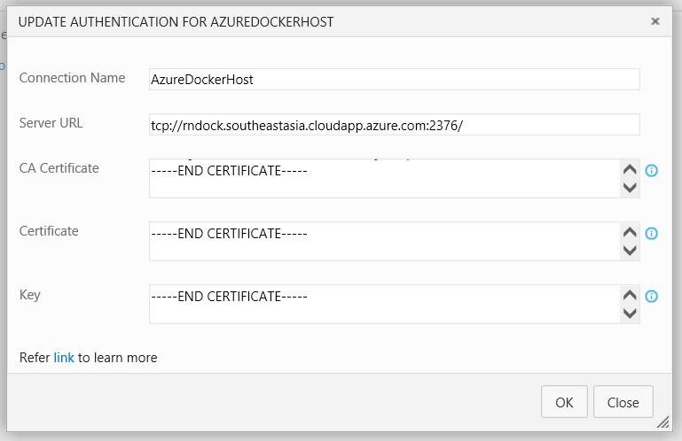
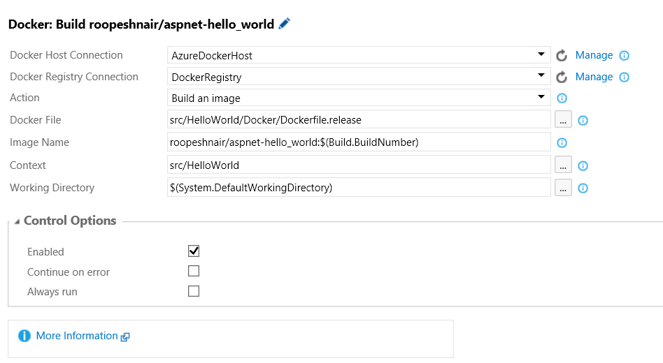
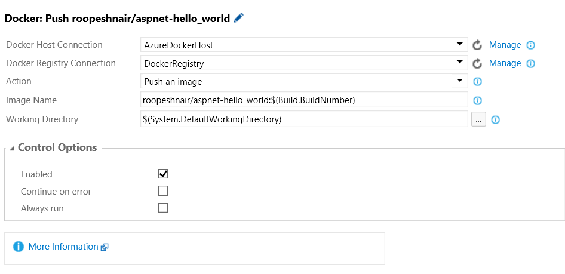
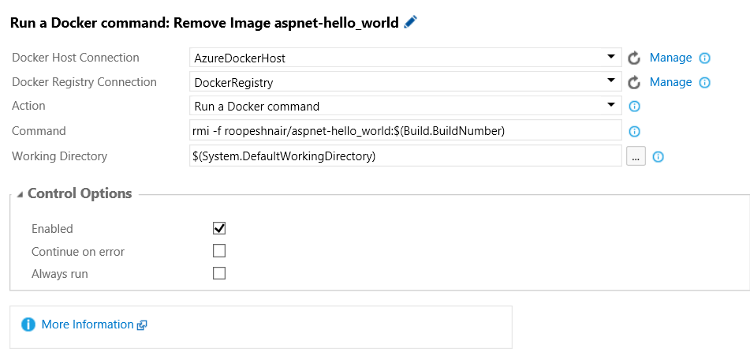
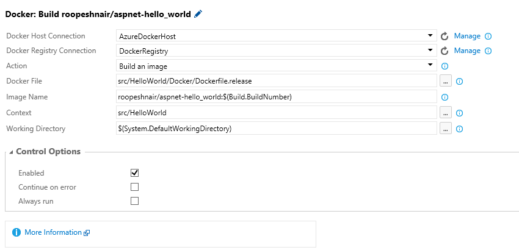

#Announcing VSTS Docker Extension Preview!

The world's largest enterprises rely on Docker to develop the world’s best applications. With the Docker extension you can now integrate your existing agile and DevOps workflows with Docker to easily manage distribution of your images. 

##What is [Docker](https://www.docker.com/)?
Docker allows you to package an application with all of its dependencies into a standardized unit for software development.

Docker containers wrap up a piece of software in a complete filesystem that contains everything it needs to run: code, runtime, system tools, system libraries – anything you can install on a server. This guarantees that it will always run the same, regardless of the environment it is running in.

##Visual Studio Team Services and Docker
Take advantage of the Visual Studio Team Services (VSTS) cloud based build, release capabilities to build your Docker image, and upload that image to Docker Registry as part of your continuous integration or continuous deployment flow. 

###Get started with Docker

In order to get access to VSTS Docker Extension, contact RM_Customer_Queries at Microsoft dot com.

##What is in the box?

This extension installs the following components:
  * A service endpoint for connecting to Docker Registry
  * A service endpoint for connecting to Docker Container Host
  * A Docker task: Set of pre-built Docker commands to manage the lifecycle of application images.
    * Build an image
    * Push an image or a repository to a Registry
    * Run an image in a Container
    * Run a Docker command
  * A Docker Compose task: Docker Compose allows you to define your multi-container application with all of its dependencies in a single file, then spin your application up in a single command.
    * Run a Docker Compose command

###How tos?

####Create a Docker Registry Endpoint:
 1. Open the Services page in your Visual Studio Team Services Control Panel
 
 
 2. In the New Service Endpoint list, choose Registry

  
  
  

 3. Enter the Name for your connection and your Docker Hub details to create the service endpoint

  

####Create a Docker Container Host Endpoint:

 1. Locate your ca.pem, key.pem and cert.pem files used to secure your Docker host.
 2. Open the Services page in your Visual Studio Team Services Control Panel.

  
 3. In the New Service Endpoint list, choose Docker Host

  
  
  
 4. Enter the Name for your connection and the URL to your Docker host
 5. Copy and paste the entire contents of each file into the appropiate spaces

  

####Build your Docker image
 1. Open your build definition and add the Docker task. The task can be found in the Build category of the Add Tasks dialog.
 2. Enter the required parameter values for the Docker task:
  * *Docker Host Connection*: Select your Docker Container Host connection.
  * *Docker Registry Connection*: Select your Docker Registry 
  * *Action*: Select Build an image
  * *Docker File*: Path to Dockerflle to use with the Docker Build action. For example **/Dockerfile. 
  * *Context*: The folder to upload to the Docker daemon to build the image.
  * *Working Directory*: The folder where the certs folder will be created and the certs written into.

  

####Push your image to Docker Hub
  1. Open your build definition and add the Docker task. The task can be found in the Build category of the Add Tasks dialog.
  2. Enter the required parameter values for the Docker task:
   * *Docker Host Connection*: Select your Docker Container Host connection.
   * *Docker Registry Connection*: Select your Docker Registry 
   * *Action*: Select Push an image
   * *Image Name*: The image you wish to create. You can tag your image by appending a : and the desired tag i.e fabrikam/webapp:$(Build.BuildId).
   * *Working Directory*: The folder where the certs folder will be created and the certs written into.

  

####Run your image in a container
  1. Open your build definition and add the Docker task. The task can be found in the Build category of the Add Tasks dialog.
  2. Enter the required parameter values for the Docker task:
   * *Docker Host Connection*: Select your Docker Container Host connection.
   * *Docker Registry Connection*: Select your Docker Registry 
   * *Action*: Select Run an image
   * *Image Name*: The image you wish to create. You can tag your image by appending a : and the desired tag i.e fabrikam/webapp:$(Build.BuildId).
   * *Container Name*: Optional, Assign a name to the container
   * *Port*: Optional, Port mappings to pass to the run comamnd in hostmachine-port:container-port format. For example, -p 80:8080 binds port 8080 of the container to port 80 of the host machine. Specify each port mapping in a new line. 
   * *Environment Variables*: Name value pairs to set as environment variables in the container. Specify each name=value pair in a new line.
   * *Working Directory*: The folder where the certs folder will be created and the certs written into.

  

####Run a Docker command
  1. Open your build definition and add the Docker task. The task can be found in the Build category of the Add Tasks dialog.
  2. Enter the required parameter values for the Docker task:
   * *Docker Host Connection*: Select your Docker Container Host connection.
   * *Docker Registry Connection*: Select your Docker Registry 
   * *Action*: Select Run a Docker command
   * *Command*: Docker command with the arguments to execute. For example 'rmi -f image-name' sans quotes to remove an image
   * *Working Directory*: The folder where the certs folder will be created and the certs written into.

  

####Run Docker Compose command
  1. Open your build definition and add the Docker Compose task. The task can be found in the Build category of the Add Tasks dialog.
  2. Enter the required parameter values for the Docker Compose task:
   * *Docker Host Connection*: Select your Docker Container Host connection.
   * *Docker Registry Connection*: Select the connection to your Docker Registry. 
   * *Docker Compose File*: Path to Docker compose file to puse. Should be a '*.yml' or '*.yaml' 
   * *Environment Variables*: Arguments that need to be passed to docker-compose file. These will be set as environment variables. Specify each argument as name=value pair in a new line. For example, HTTP_PROXY=fabrikamweb.mydomain.com, HTTP_PORT=80
   * *Project Name*: Specify an alternate project name. 
   * *Docker Compose Command*: Docker Compose command along with its arguments. for example, Using 'up -d' starts the containers in the background and leaves them running, other examples are 'down --rmi all -v' or 'restart'. Note: Recommended to use detached mode (-d) to avoid blocking the agent..
   *  *Working Directory*: The folder where the certs folder will be created and the certs written into.

  

###Trademarks

Docker and the Docker logo are trademarks or registered trademarks of Docker, Inc. in the United States and/or other countries. Docker, Inc. and other parties may also have trademark rights in other terms used herein

